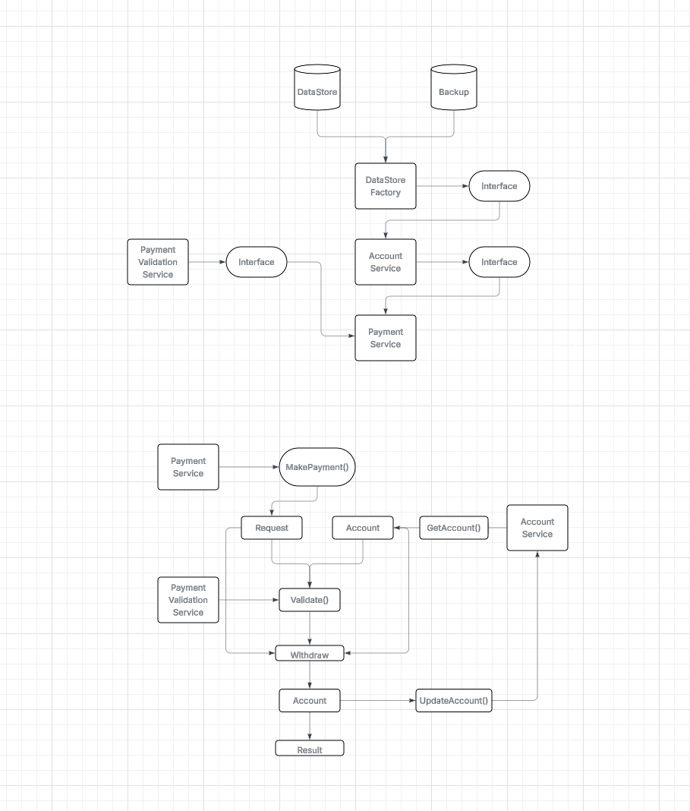

### Test Description
In the 'PaymentService.cs' file you will find a method for making a payment. At a high level the steps for making a payment are:

 - Lookup the account the payment is being made from
 - Check the account is in a valid state to make the payment
 - Deduct the payment amount from the account's balance and update the account in the database
 
What we’d like you to do is refactor the code with the following things in mind:  
 - Adherence to SOLID principals
 - Testability  
 - Readability 

We’d also like you to add some unit tests to the ClearBank.DeveloperTest.Tests project to show how you would test the code that you’ve produced. The only specific ‘rules’ are:  

 - The solution should build.
 - The tests should all pass.
 - You should not change the method signature of the MakePayment method.

You are free to use any frameworks/NuGet packages that you see fit.  
 
You should plan to spend around 1 to 3 hours to complete the exercise.

### My Improvements

In refactoring the code I've done the following.

Moved the Account operations to it's own service (Single Responsability Principle).

Moved the AccountDataStore into AccountService as it's related to the Account and used the
Factory pattern to get the configured one (Main or Backup).

Created multiple Payment Validators and instantiate the one needed through a Factory pattern, and interfaced all of them through a common interface that implements the function to Validate.

Added null checking and made the Account class Balance setter private and implemented internal Withdraw and Deposit functions for Balance.

Added Unit testing for Services, Data and Validators.

### If I had more time

If I had more time I would have made the operations Async, added Logging and added an actual data source and project files to manual test (API Controller, Actual Repository and maybe a frot end or Swagger or OpenAPI implementation).

### Made a high level overview of my refactoring logic

